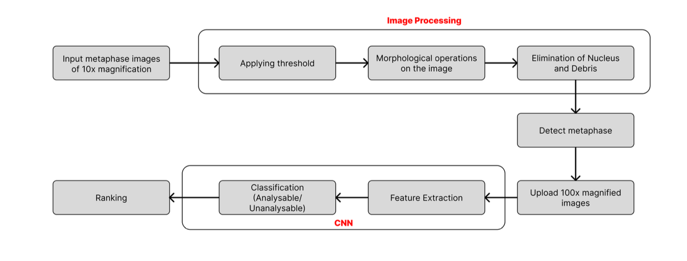
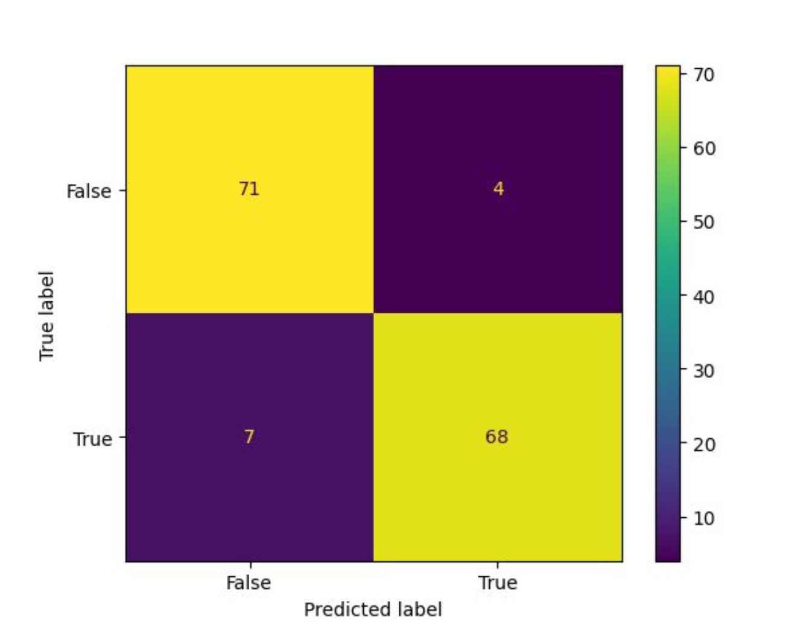

# Metaphase Detector

A three-stage clinical pipeline to automate metaphase chromosome selection for karyotyping — a routine but labour-intensive task in the diagnosis of cancers and genetic disorders.

Built as a B.Tech final year capstone project at College of Engineering Attingal (2022–23), in collaboration with the Regional Cancer Centre, Thiruvananthapuram.

**Team:** Adhithyan S · Aswathy S · Ganesh A · Govind Ramababu  
**Guide:** Smt. Remya R.S., Assistant Professor, Dept. of CSE

---

## The Problem

Karyotyping requires cytogeneticist to manually scan hundreds of microscope slide images to find metaphase chromosome spreads that are suitable for analysis — a process that is slow, subjective, and prone to inter-observer variation. Of approximately 200 metaphases prepared per patient, only around 20 are suitable for karyotyping. Automating this selection step directly reduces diagnostic time and improves consistency.

---

## System Architecture



The system is divided into three modules that run in sequence:

**Module 1 — Metaphase Detection (10x images)**  
Microscope slide images at 10x magnification are processed using classical image processing: grayscale conversion, Otsu thresholding, morphological erosion and dilation, and contour detection with circularity filtering to separate metaphase chromosome clusters from nuclei and debris. Detected metaphase coordinates are saved for the next stage.

**Module 2 — Analysable/Unanalysable Classification (100x images)**  
The stage moves to 100x magnification at each saved coordinate. A deep CNN based on the AlexNet architecture classifies each metaphase image as analysable or unanalysable. The network takes 227×227 RGB input through five convolutional-pooling blocks into two fully connected layers (4096 neurons each) with dropout regularisation, and a sigmoid output for binary classification.

**Module 3 — Ranking**  
Analysable metaphases are ranked by chromosome spread area — a mathematical sorting algorithm that computes the total area of detected chromosomes per image and surfaces the top 20 for the cytogeneticist.

---

## Results

| Metric | Value |
|---|---|
| Training accuracy | 85% |
| Validation accuracy | 93% |
| Precision (analysable class) | 94.44% |
| Recall (analysable class) | 91% |
| F1-score | 93% |
| Average precision (AP) | 0.97 |
| Cross-validation | 5×2, 25 epochs |
| Test set | 150 images (75 analysable, 75 unanalysable) |



---

## Dataset

Two datasets were used to train and evaluate the CNN:

- **Public dataset:** G-banded metaphase images published by Remya Remany Sathyan et al. at Mendeley Data (DOI: 10.17632/nn4353y2xx.1) — 100 images at 2048×1536 resolution captured using a Leica DM 2500 microscope.
- **Clinical dataset:** G-banded metaphase images prepared at the Regional Cancer Centre, Thiruvananthapuram — 3000 images (1500 analysable, 1500 unanalysable) at 227×227. Not publicly available due to patient confidentiality protocols.

---

## Stack

| Layer | Technology |
|---|---|
| Image processing | Python, OpenCV |
| Deep learning | TensorFlow, Keras (AlexNet) |
| Backend API | FastAPI, Python |
| Database | MongoDB |
| Frontend | React |

---

## Repository Structure

```
metaphase-detector/
├── backend/
│   ├── config/db.py          # MongoDB connection
│   ├── models/               # Pydantic data models
│   ├── routes/               # FastAPI route handlers
│   ├── schemas/              # Response serialisers
│   ├── index.py              # App entry point
│   └── requirements.txt
├── frontend/                 # React web application
│   └── src/
│       ├── Screens/          # Page-level components
│       └── components/       # Shared UI components
└── docs/
    ├── system-design.png
    └── confusion-matrix.png
```

> **Note:** This repository contains the web application (FastAPI backend + React frontend). The image processing pipeline and CNN training code were not preserved in version control — a common outcome for undergraduate group projects where development happened across multiple machines without a unified Git workflow.

---

## Running the Backend

```bash
cd backend
pip install -r requirements.txt
uvicorn index:app --reload
```

API docs available at `http://localhost:8000/docs`

MongoDB must be running locally or set the `MONGO_URL` environment variable:

```bash
export MONGO_URL="mongodb://localhost:27017"
```

---

## Running the Frontend

```bash
cd frontend
npm install
npm start
```

---

## My Contribution

I was primarily responsible for the image processing pipeline (Module 1, joinly with Aswathy S), the CNN architecture and training (Module 2, jointly with Ganesh A and Aswathy S), and the FastAPI backend including MongoDB integration. The React frontend was built primarily by Ganesh A and Govind Ramababu.